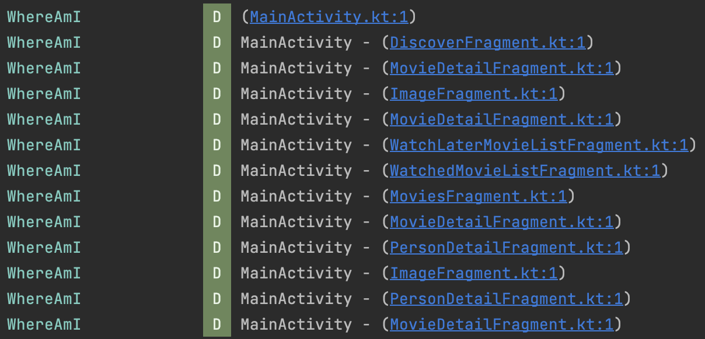
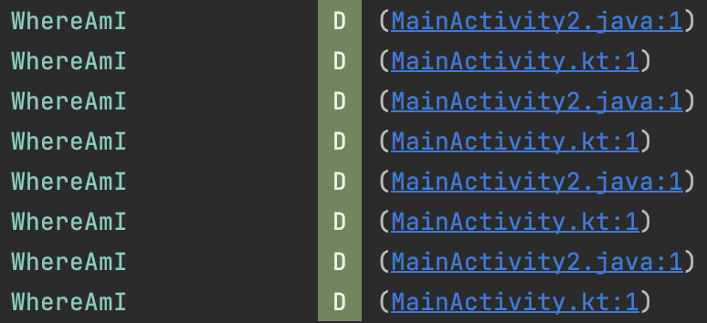

# Where Am I?

With this library,
- You can see which page you are on,
- Shows which pages it went through,
- It allows you to open the relevant screen by clicking it.
- It distinguishes whether the screen is kotlin or java.

| Activity-Fragment | Kotlin-Java |
| --- | ----------- |
|   | |

Download
--------
Gradle:

```gradle
repositories {
  maven { url "https://jitpack.io" }
}

dependencies {
  implementation 'com.github.ugurbuga:where-am-i:1.0.0'
}
```

How do I use "WhereAmI"?
-------------------
You need to add init method to application class.<br/>
init method has 2 property.<br/>
First parameter, you need set application class.<br/>
Second parameter, you can close/open logcat loging.

Simple use cases will look something like this:

```kotlin
class App : Application() {

    override fun onCreate() {
        super.onCreate()
        WhereAmI.init(application = this, logEnabled = true)
    }
}
```
